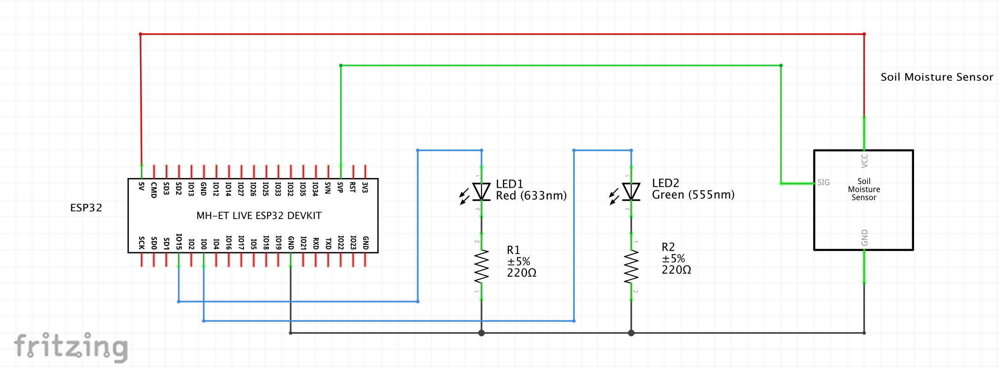

# plant-monitor
A soil moisture monitor for plants built using an ESP32 microcontroller. <br></br>
When the soil moisture value is not within the threshold, the red LED turns on and a message is sent over WhatsApp telling me to water my plant! When the plant has been watered enough such that the soil moisture value is within the threshold once again, the green LED will turn on. 
 <br></br>
The schematic for the project is shown below:  <br></br>
I've included ```soil_test.ino``` as a way to find the threshold value of the soil for any plant if anyone would like to try the project with their own plants. The *CallMeBot* API is used to send messages over WhatsApp using the ESP32. The setup instructions can be found [here](https://www.callmebot.com/blog/free-api-whatsapp-messages/). I also noticed that the soil moisture sensor I used measured *higher* values when the soil was dry compared to when it was moist. Different sensors may behave differently and so the logic in the ```loop()``` function may have to be reversed when using different sensors. 